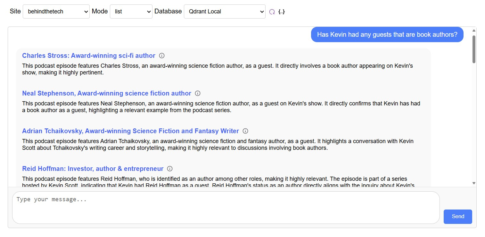
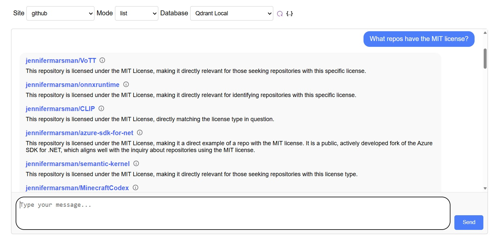

# Demos

[Import data from an RSS feed](#import-data-from-an-rss-feed)

[Agent-enable your Github data](#agent-enable-your-github-data)

## Import data from an RSS feed
With NLWeb, you can easily import data from an RSS feed for querying over in natural language using a script.  

First, navigate to the NLWeb --> code directory.  Before you run this command, ensure that the database you want to write to is set as the `preferred_endpoint` in your config_retrieval.yaml file in the config directory (or use the --database switch). In this example, I am using qdrant_local.  

The format for this command is the following.  Replace with an RSS feed, and choose a descriptive site name for that data.   
```
python -m tools.db_load <rss feed link> <site name> 
```

As an example, here is the RSS feed for Kevin Scott's podcast "Behind the Tech".  This command will extract the data from the RSS feed, create embeddings, and store those embeddings in the vector database specified in the config_retrieval.yaml file.  
```
python -m tools.db_load https://feeds.libsyn.com/121695/rss behindthetech
```

Now, using our debug tool, you can easily ask questions about your Github data in natural language.  Start your web server by running `python app-file.py` from the code directory.  Then in a web browser, navigate to http://localhost:8000/static/str_chat.html.  Select "behindthetech" from the site dropdown and your retrieval provider from the database dropdown (I am using "Qdrant Local").  Then ask questions in natural language.  



If you have created a new site name, you will need to add this to the list of site options in the dropdown-interface.js file in the static directory for it to appear in the tool above.  

NOTE: to remove the "behindthetech" data from your vector database, run this:
```
python -m tools.db_load --only-delete delete-site behindthetech
```


## Agent-enable your Github data
Let's create an agent that utilizes NLWeb over GitHub data.  

First, follow these instructions to get a fine-grained personal access token from GitHub: https://docs.github.com/en/authentication/keeping-your-account-and-data-secure/managing-your-personal-access-tokens#creating-a-fine-grained-personal-access-token 

Copy the .env.example file into a new file called .env.  In the .env file, update the value of GITHUB_TOKEN to the value of the token you generated.  

First, we will run a script to get your Github data into a format that NLWeb can consume.  It will output a json file.  From the **demo** folder, run:
```
python extract_github_data.py
```

Then, you can extract this data, create embeddings, and import them into your retrieval provider with this script.  From the **code** folder, run the db_load tool, pointing to the json file that you just created and giving it a site name like "github":
```
cd ..\code
python -m tools.db_load ..\demo\ghrepoinfo.json github
```

Finally, you can repeat the same process as above.  Start the web server with the below command.
```
python app-file.py
```

Then in a web browser, navigate to http://localhost:8000/static/str_chat.html.  You can now ask questions of your data. 



