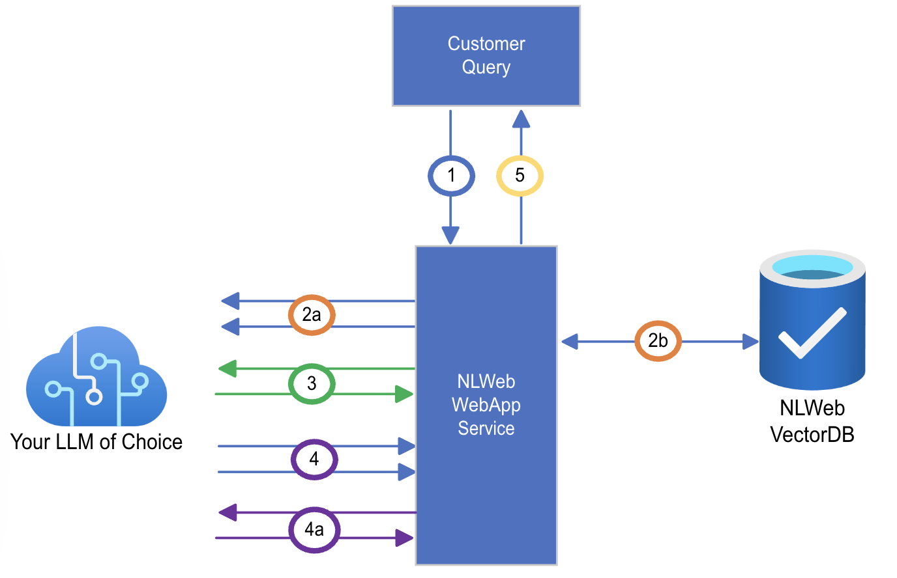

# Life of a Chat Query

NLWeb aims to make it very simple to provide conversational interfaces to websites (or more generally, collections of content) which can be abstracted as 'lists of items'. Items maybe recipes, events, products, books, movies, etc. NLWeb leverages the fact that most such websites already make their data available in a structured form, in a common vocabulary, namely that provided by Schema.org. Given the widespread prevalence of schema.org based markup, it is not surprising that most LLMs seem to understand schema.org markup very well. We exploit this to make it easy to create conversational interfaces.

This document has a brief description of the processing that is done when a User submits a query to an NLWeb instance. At a high level, the flow is very similar to the processing of a query in Web search. The main difference is that in 'traditional' (i.e., pre-llm) search engines, there would be specialized algorithms or special purpose models for many of the tasks involved in the query processing. This both made it very expensive to develop robust search tools and also made them somewhat limited. Here, we rely on LLMs to perform these tasks.

Depending on the request parameters, control of the results that are returned can stay with 'traditional' code, which affords greater control over the returned results. In particular, the result can be a list of items, each of which includes the data item corresponding to that result, preventing hallucination of items. So, results can be less than most relevant, but a result will not be 'made up'.

1. User submits next query in the conversation

2. Multiple parallel calls are made for checking relevancy, decontextualizing query based on conversation history, determining if there are items that should be remembered in memory, etc. Each of these is implemented as a call to an LLM, though alternate implementations are possible. At the end of this, we have a decontextualized query, which we know is relevant to the site, that we have all the information required to answer the query, etc. In some cases, this step might result in the query being broken down into multiple smaller queries. In some cases, the system may return a response (e.g., when more information is required for further processing) and not go any further.

    - 2b. Fast Track: We expect that most conversations, especially early on, will resemble search and will involve a query that is relevant, doesn't require decontextualization, etc. So, it is very likely that step 2 will not make any changes to what follows. Consequently, after a light weight check to see if this condition might hold, a 'fast track' path to (3) is launched, in parallel to (2). Results from (4) are blocked from being sent to the user until the results of the analysis from (2) are completed. In some cases, the results from the fast track channel may be entirely dropped.

3. The (decontextualized) query/queries is sent to a database service to retrieve potential answers. Typically, this is a vector database and the retrieval is a combination of tfidf scores on embeddings and structured data constraints. The data is returned as a set of json objects encoded in schema.org schema.

4. The results returned from the database are scored. This is again done with a set of very specific calls to an LLM. The LLM may also be asked to generate a 'snippet' that is appropriate for the query. The top N results that have a score above some threshold, together with the score, snippet and the associated database object are collected.

    4a. Optional: If the user has requested post processing, this is done and the results from (4), together with the results from post processing are returned to the user. Post processing may for example summarize the results in (4) or go a step further and try to use the results from (4) to answer the query.

5. The results are then returned to the user in the specified format.

## Notes

- Processing a single query might involve over 50 LLM API calls. The calls tend to be very narrow and specific. Different kinds of calls may be to different models. The prompts can be specialized, declaratively, for particular object types (with the default type hierarchy from schema.org), e.g., Recipe vs Real Estate and further for specific sites.

- Since the items that are returned each come from the database, the user can be assured that none of the results are 'made up'. There is of course the possibility that the results are not the best, but there will not be result results returned that are not in the database. Post processing may degrade this, however, so be sure to test any you add carefully.
