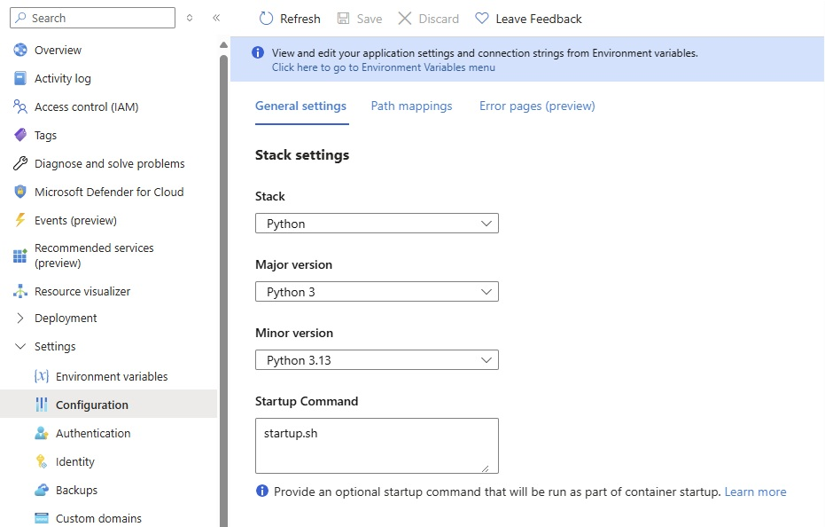
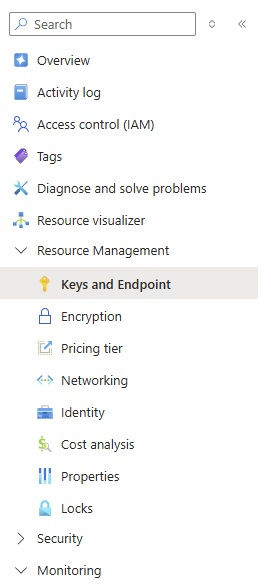
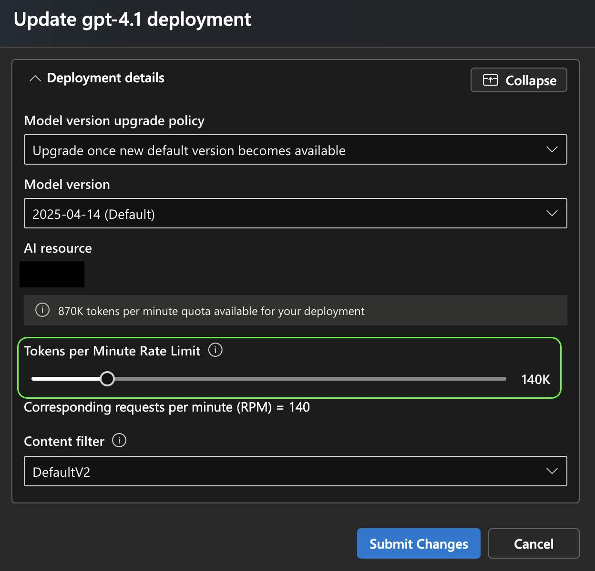

# NLWeb Azure Setup Guide

## Getting Started

Use these instructions to configure NLWeb to run in Azure - below we have instructions for:

<!-- - [Deploying NLWeb to Azure via the Azure Portal](#deploying-nlweb-via-the-azure-portal) -->
- [NLWeb Azure Setup Guide](#nlweb-azure-setup-guide)
  - [Getting Started](#getting-started)
  - [Prerequisites](#prerequisites)
  - [Deploying NLWeb via the Azure CLI](#deploying-nlweb-via-the-azure-cli)
  - [Azure WebApp Monitoring and Troubleshooting](#azure-webapp-monitoring-and-troubleshooting)
    - [Logs](#logs)
    - [Diagnostic Tools](#diagnostic-tools)
    - [Health Check](#health-check)
  - [Azure OpenAI Endpoint Creation](#azure-openai-endpoint-creation)
  - [Increasing your Azure OpenAI Rate Limits](#increasing-your-azure-openai-rate-limits)

## Prerequisites

These instructions assume that you have an [Azure subscription](https://go.microsoft.com/fwlink/?linkid=2227353&clcid=0x409&l=en-us&icid=nlweb), the [Azure CLI installed locally](https://learn.microsoft.com/cli/azure/install-azure-cli), and have Python 3.10+ installed locally.

<!-- commenting out until we can test after making repo public.
## Deploying NLWeb via the Azure Portal

1. Create a [WebApp in the Azure Portal](https://portal.azure.com/?feature.msaljs=true#view/WebsitesExtension/AppServiceWebAppCreateV3Blade):
    - Create a new resource group and instance name.
    - Publish: Code
    - Choose Python 3.13 as the runtime stack
    - Select Linux as the operating system
    - Select "East US 2" or "Sweden Central" as the region
    - Select "Premium V3 P1V3 (195 minimum ACU/vCPU, 8 GB memory, 2 vCPU)" as the pricing plan
    - No database is needed.

2. Set up deployment source:
    - Choose GitHub or Azure DevOps
    - Connect to your repository
    - Set up continuous deployment

3. Configure application settings:
    - Add all the environment variables from `.env.template`
    - Set `WEBSITE_RUN_FROM_PACKAGE=1`
    - Set `SCM_DO_BUILD_DURING_DEPLOYMENT=true`
    - Don't forget to click "Apply" after all app settings have beeen added to save your changes!

4. Configure startup command to:

    ```sh
    startup.sh
    ```
    This can be found under "Settings" in the "Configuration" section.  It's in the default "General settings" tab.  Again, don't forget to click "Save" when you are done to save your changes.

     -->

## Deploying NLWeb via the Azure CLI

1. Log in to Azure:

    ```sh
    az login
    ```

2. Create a resource group (if needed) - if you already have a resource group you want to use, skip to the next step:

    ```sh
    az group create --name yourResourceGroup --location eastus2
    ```

3. Create an App Service Plan:

    ```sh
    az appservice plan create --name yourAppServicePlan --resource-group yourResourceGroup --sku P1v3 --is-linux
    ```

4. Create a Web App:

    ```sh
    az webapp create --resource-group yourResourceGroup --plan yourAppServicePlan --name yourWebAppName --runtime "PYTHON:3.13"
    ```

5. Configure environment variables; modify the below command to include all of the environment variables in your .env:

    ```sh
    az webapp config appsettings set --resource-group yourResourceGroup --name yourWebAppName --settings \
    AZURE_VECTOR_SEARCH_ENDPOINT="https://TODO.search.windows.net" \
    AZURE_VECTOR_SEARCH_API_KEY="TODO" \
    AZURE_OPENAI_ENDPOINT="https://TODO.openai.azure.com/" \
    AZURE_OPENAI_API_KEY="TODO" \
    WEBSITE_RUN_FROM_PACKAGE=1 \
    SCM_DO_BUILD_DURING_DEPLOYMENT=true \
    NLWEB_OUTPUT_DIR=/home/data \
    ```

6. Set startup command:

    ```sh
    az webapp config set --resource-group yourResourceGroup --name yourWebAppName --startup-file "startup.sh"
    ```

7. Deploy code using ZIP deployment. Do this from within your cloned NLWeb folder, making sure you have set your preferred providers you will use in the 'code/config' folder before doing this.  If you are not using the 'main' branch, replace this with the branch name to use.

    ```sh
    git archive --format zip --output ./app.zip main

    ```

8. Deploy code using ZIP deployment:

    ```sh
    az webapp deployment source config-zip --resource-group yourResourceGroup --name yourWebAppName --src ./app.zip
    ```

## Azure WebApp Monitoring and Troubleshooting

### Logs

View logs in Azure Portal or using Azure CLI:

```sh
az webapp log tail --name yourWebAppName --resource-group yourResourceGroup
```

### Diagnostic Tools

Azure App Service provides diagnostic tools in the Azure Portal:

1. Go to your Web App
2. Navigate to "Diagnose and solve problems"
3. Choose from available diagnostics tools

### Health Check

The application includes a health endpoint at `/health` that returns a JSON response indicating service health.

## Azure OpenAI Endpoint Creation

If you don't have an LLM endpoint already, you can follow these instructions to deploy a new endpoint with Azure OpenAI:

1. Create an Azure OpenAI resource at via the [portal](https://portal.azure.com/#create/Microsoft.CognitiveServicesOpenAI).  Use these [instructions](https://learn.microsoft.com/azure/cognitive-services/openai/how-to/create-resource) as a guide as needed.
    > Notes:
    > - Make sure you select a region where the models you want to use are available.  Refer to [AOAI Model Summary Table and Region Availability](https://learn.microsoft.com/azure/ai-services/openai/concepts/models?tabs=global-standard%2Cstandard-chat-completions#model-summary-table-and-region-availability) for more info.  To use the Azure OAI defaults of 4.1 and 4.1-mini in the [config_llm.yaml](code/config/config_llm.yaml), we recommend using `eastus2` or `swedencentral`.
    > - If you are calling this endpoint locally, make the endpoint accessible from the internet in the network setup step.

2. Once your AOAI resource is created, you'll need to deploy your models within that resource.  This is done from Azure AI Foundry under [Deployments](https://ai.azure.com/resource/deployments). You can see instructions for this at [Azure AI Foundry - Deploy a Model](https://learn.microsoft.com/azure/ai-services/openai/how-to/create-resource?pivots=web-portal#deploy-a-model).
    > Notes:
    > - Make sure the resource you created in the prior step is showing in the dropdown at the top left of the screen.
    > - You will need to repeat this step **3 times** to deploy three base models: `gpt-4.1`, `gpt-4.1-mini`, and `text-embedding-3-small`.

3. You'll need to add your Azure OpenAI endpoint and key to your .env file see step 5 of Local setup in the [README file](/README.md). You can find the endpoint API key for the Azure OpenAI resource that you created above in the [Azure portal](https://portal.azure.com/?feature.msaljs=true#view/Microsoft_Azure_ProjectOxford/CognitiveServicesHub/~/OpenAI), not [Azure AI Foundry](https://ai.azure.com) where you were deploying the models.  Click on the Azure OpenAI resource, and then in the left-hand sidebar under "Resource Management," select "Keys and Endpoint."



## Increasing your Azure OpenAI Rate Limits

If you are seeing a lot of timeout issues, you may need to increase your AOAI rate limits.

1. Go to the Azure AI Foundry [Deployments Tab](https://ai.azure.com/resource/deployments) where your deployed models are shown.  You will need to repeat these instructions for each of the 3 models/embeddings.

2. Click on the radio dial to the left of the model model. (Alternately, you can click into the model to see a full page of the configuration.)

3. Click 'Edit' in the top of the list of models. ('Edit' is at the top left of the next page if you clicked into the model.)

4. In the popup, scroll to the bottom where it says 'Tokens per Minute Rate Limit' and drag the slider to a higher value.


