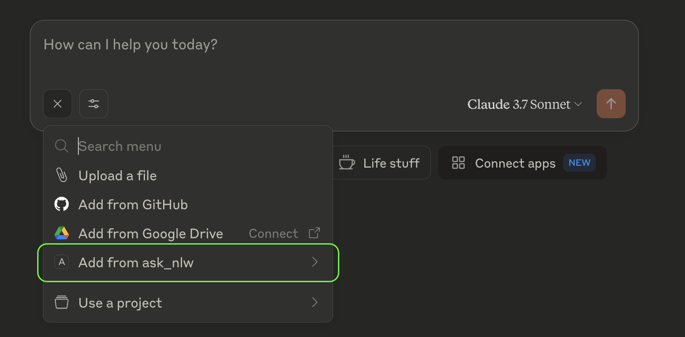

# Setting up Claude to talk to NLWeb

## Getting Started

Since NLWeb includes an MCP server by default, you can configure Claude for Desktop to talk to NLWeb!

## Prerequisites

Assumes you have [Claude for Desktop](https://claude.ai/download). This works on both macOS and Windows.

## Setup Steps

1. If you do not already have it, install MCP in your venv:

    ```sh
    pip install mcp
    ```

2. Next, configure your Claude MCP server. If you don't have the config file already, you can create the file at the following locations:

    - macOS: `~/Library/Application Support/Claude/claude_desktop_config.json`
    - Windows: `%APPDATA%\Claude\claude_desktop_config.json`

    The default MCP JSON file needs to be modified as shown below:

### macOS Example Configuration

```json
{
  "mcpServers": {
    "ask_nlw": {
      "command": "/Users/yourname/NLWeb/myenv/bin/python",
      "args": [
        "/Users/yourname/NLWeb/code/chatbot_interface.py",
        "--server",
        "http://localhost:8000",
        "--endpoint",
        "/mcp"
      ],
      "cwd": "/Users/yourname/NLWeb/code"
    }
  }
}
```

### Windows Example Configuration

```json
{
  "mcpServers": {
    "ask_nlw": {
      "command": "C:\\Users\\yourusername\\NLWeb\\myenv\\Scripts\\python",
      "args": [
        "C:\\Users\\yourusername\\NLWeb\\code\\chatbot_interface.py",
        "--server",
        "http://localhost:8000",
        "--endpoint",
        "/mcp"
      ],
      "cwd": "C:\\Users\\yourusername\\NLWeb\\code"
    }
  }
}
```

> **Note:** For Windows paths, you need to use double backslashes (`\\`) to escape the backslash character in JSON.

1. From your code folder, enter your virtual environment and start your NLWeb local server. Make sure it is configured to access the data you would like to ask about from Claude.

    ```sh
    # On macOS
    source ../myenv/bin/activate
    python app-file.py

    # On Windows
    ..\myenv\Scripts\activate
    python app-file.py
    ```

2. Open Claude Desktop. It should ask you to trust the 'ask_nlw' external connection if it is configured correctly. After clicking yes and the welcome page appears, you should see 'ask_nlw' in the bottom right '+' options. Select it to start a query.

    

3. Voilà! When you ask a question and want to query NLWeb, just type 'ask_nlw' in your prompt to Claude. You'll notice that you also get the full JSON script for your results. Remember, you have to have your local NLWeb server started to use this option.

## Troubleshooting

If you encounter issues with Claude connecting to NLWeb, you can enable developer mode to help diagnose problems:

### Enabling Developer Mode in Claude Desktop

1. Open the Claude Desktop application
2. Menu -> Help -> Enable Developer mode
3. Restart Claude Desktop to apply the debug settings

### Checking Claude Log Files

Claude stores detailed logs about MCP connections that can be helpful for troubleshooting:

#### Log File Locations

- **macOS**: `~/Library/Logs/Claude/`
- **Windows**: `%APPDATA%\Claude\logs\`

#### Important Log Files

- `mcp.log` - Contains general logging about MCP connections and connection failures
- `mcp-server-ask_nlw.log` - Contains error (stderr) logging from the NLWeb MCP server

#### Viewing Log Files

You can use the following commands to view recent logs and monitor them in real-time:

```sh
# macOS/Linux
tail -n 20 -f ~/Library/Logs/Claude/mcp*.log

# Windows
type "%APPDATA%\Claude\logs\mcp*.log"
```

### Common Issues

- If Claude doesn't show the 'ask_nlw' option, check that your config file is in the correct location and properly formatted
- Verify that your NLWeb server is running before attempting to connect
- Make sure you have installed mcp in your venv
- Check the developer console for connection errors or file path issues
- Make sure all file paths in the configuration use the correct format for your operating system
- Make sure Claude desktop fully closed (Menu -> File -> Exit) to read changes to config

For persistent issues, you can try restarting both the NLWeb server and Claude Desktop application.
