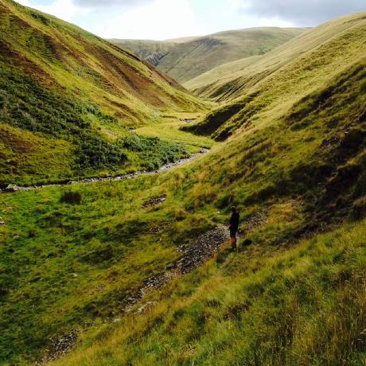

# About this site

The main focus is now **Lawrence Rowland — independent project experiments**: public enquiries that use concrete toy scenarios to make difficult ideas visible and testable. Begin with the [projects](/side-projects.html), try an example, then follow its sources, construction and limitations. The aim is to help us understand what a method contributes, including where it falls short.

The [library of worked examples and earlier methods](/library.html) remains a distinct part of the site. It keeps captured answers to bounded problems alongside the work that led to them. The account below explains the site's original portfolio-management purpose; it should not be read as evidence that every current prototype has been validated for real-world use. Reuse terms are specific to each repository and its sources.

## The site's earlier purpose

1. TOC 
{:toc}

# Purpose

- This website introduces various tools and frameworks available for better project portfolio management. 

- It shows what to use for different business challenges. 

# Description 

This site provides open frameworks and tool-sets to set up and deliver projects, programmes and portfolios. 

As well as conventional project management, this site introduces specific ways to use machine-learning, natural language understanding and graph databases to deliver better projects. 

Each project and portfolio delivered teaches lessons which are built back into the frameworks. 

The examples provided are no-code or low-code approaches so that portfolio managers can apply them directly.

# How to use 

Start on the main page to access various pages of [guidance](https://lawrencerowland.github.io/)

When you are ready to test or apply a particular tool or approach,then you will find a link to the relevant library (repository), which can be downloaded or cloned, ready for use and modification. 

Or go straight to my code and document libraries (repositories) for implementation [here](https://www.github.com/lawrencerowland)

For information about me personally, feel free to contact me directly.

Check the licence and source terms in the relevant repository before reuse. Suggestions and improvements are welcome.

# Motivation

Other project and portfolio managers can use tools and frameworks that have worked well for me. The generosity of Open Source practice has helped me to learn and work better, and to continually improve on these frameworks. I also learn from the ways that others apply and extend things that have worked for me. 

Despite all this, project management remains as art as science. It is more about people and teams than charts and KPIs. More about consensus, stories, incentives and unintended consequences than top-down planning and flowcharts. Tools and frameworks only do so much. 

It is my experience that by building and re-building useful frameworks, the mechanics of projects take a little less time, and so time and attention is freed up on a project. 

This time can be used for the real work of understanding the company, the context of the portfolio, and finding the unique approach, or having the right conversation, that gives the current portfolio a chance to succeed. 

# Contact
I am easy to find on twitter and Linked in (Uk). Or raise an issue/suggestion in the relevant repository. 
