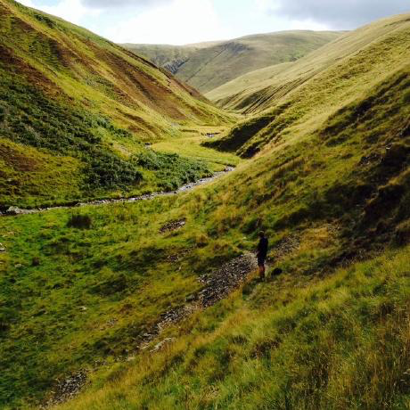

# About

1. TOC 
{:toc}

# Purpose

- This website introduces various tools and frameworks available for better project portfolio management. 

- It shows what to use for different business challenges. 

# Description 

This site provides open frameworks and tool-sets to set up and deliver projects, programmes and portfolios. 

As well as conventional project management, this site introduces specific ways to use machine-learning, natural language understanding and graph databases to deliver better projects. 

Each project and portfolio delivered teaches lessons which are built back into the frameworks. 

The examples provided are no-code or low-code approaches so that portfolio managers can apply them directly.

# How to use 

Start on the main page to access various pages of [guidance](https://lawrencerowland.github.io/)

When you are ready to test or apply a particular tool or approach,then you will find a link to the relevant library (repository), which can be downloaded or cloned, ready for use and modification. 

Or go straight to my code and document libraries (repositories) for implementation [here](https://www.github.com/lawrencerowland)

Please feel free to use for commercial or private purposes. Where you make improvements, please share them if appropriate. 

# Motivation

Other project and portfolio managers can use tools and frameworks that have worked well for me. The generosity of Open Source practice has helped me to learn and work better, and to continually improve on these frameworks. I also learn from the ways that others apply and extend things that have worked for me. 

Despite all this, project management remains as art as science. It is more about people and teams than charts and KPIs. More about consensus, stories, incentives and unintended consequences than top-down planning and flowcharts. Tools and frameworks only do so much. 

It is my experience that by building and re-building useful frameworks, the mechanics of projects take a little less time, and so time and attention is freed up on a project. 

This time can be used for the real work of understanding the company, the context of the portfolio, and finding the unique approach, or having the right conversation, that gives the current portfolio a chance to succeed. 

# Contact
I am easy to find on twitter and Linked in (Uk). Or raise an issue/suggestion in the relevant repository. 
