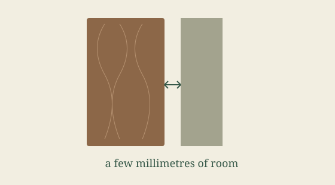
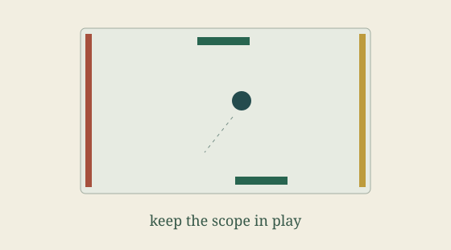
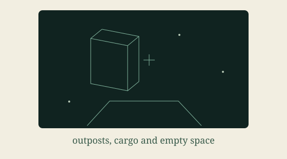

<header class="pw-page-heading"><h1>Wider interest</h1>
Topics beyond projects and AI.
</header>

<a href="door-moisture-model/"><h2>A little room to move</h2>
Change the moisture assumptions around an old timber door. Watch a few millimetres of clearance disappear.
</a>
<a href="project-management-pong/"><h2>Project Management Pong</h2>
Pass scope between two managers. A playful game with some deliberately awkward incentives.
</a>
<a href="hs2-elite/"><h2>HS2 Elite</h2>
Fly, dock and trade between six fictional outposts. Railway names become a tiny space adventure.
</a>

- [John Burnet of Barn's journey](john-burnet-of-barns-journey.html)
- [Johnson's Dictionary Project](johnsons-dictionary-project.html)
- [Caesar's Gallic Wars Rivers](caesars_gallic_wars_rivers.html)
- [Seeing the fourth dimension inside the third](polytope.html)
- [Until the conkers ran out — a playground autumn](conker-season.html)
